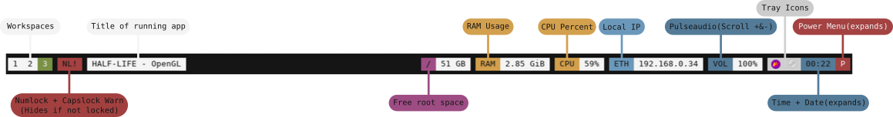

# DOTFILES

Here is my dotfiles, most of it still WIP.
There may be some "lost" files that will not be uploaded.

A list of the things I'm ==Using== and it's info

| InUse |   Package   |       Description       |
|-------|-------------|-------------------------|
|  YES  | [Yambar](https://codeberg.org/dnkl/yambar)      | [+Info](https://github.com/abiES76/dotfiles?tab=readme-ov-file#yambar) - search labels (w/wofi) - sway/i3 ws - app title - ram + vol status - local ip - date and time - power label (w/wlogout) |
|  YES  | [Sway](https://github.com/swaywm/sway)        | Normal as far as I know |
|  YES  | [Fnott](https://codeberg.org/dnkl/fnott)       | +Info - B&W               |
|  YES  | [Wofi](https://sr.ht/~scoopta/wofi/)        | +Info - Horizontal B&W    |
|  YES  | [Wlogout](https://github.com/ArtsyMacaw/wlogout)     | +Info - 1 Lane - Red      |
|  NO   | [Rofi](https://github.com/davatorium/rofi)        |    |
|  NO   | [Polybar](https://github.com/polybar/polybar)     | [+Info](https://github.com/abiES76/dotfiles?tab=readme-ov-file#polybar) - Workspaces(i3) - Num+Capslock warning - App Title - Free Space in Root - RAM&CPU Usage - Local IP - Pulseaudio - Tray, expandable time and expandable power menu |
|  NO   | [I3](https://github.com/i3/i3)          | Not in repo/Not using   |
| - [ ] | [Dunst]() | B&W - almost the same as Fnott |
## Yambar

Todo:
- [ ] Disk Usage Script
- [ ] Scrollable Volume Script 
- [ ] New Date&Time Label + Script

## Polybar

