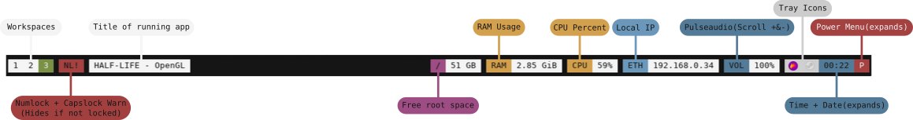
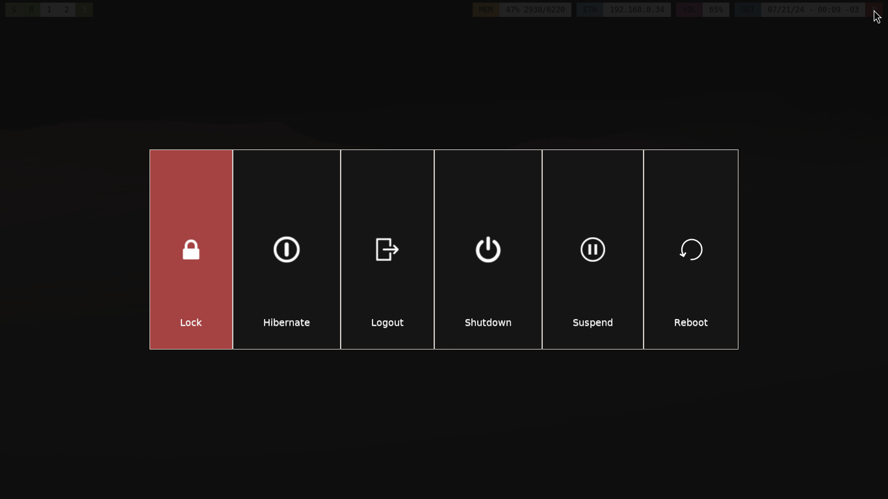

Here is my dotfiles, most of it still WIP.
There may be some "lost" files that will not be uploaded.

A list of the things I'm ==Using== and it's info

| InUse |   Package   |       Description       |
|-------|-------------|-------------------------|
| NO | [Dunst](https://github.com/dunst-project/dunst) | [Files](https://github.com/abiES76/dotfiles/tree/main/dunst) B&W - almost the same as Fnott but a hell lot more text |
| YES | [Fnott](https://codeberg.org/dnkl/fnott) | [Files](https://github.com/abiES76/dotfiles/tree/main/fnott) ~ [IMG](https://github.com/abiES76/dotfiles?tab=readme-ov-file#fnott) - B&W |
| YES | [Foot](https://codeberg.org/dnkl/foot) | [Files](https://github.com/abiES76/dotfiles/tree/main/foot) - It's foot, it only has the colors that I want|
| NO | [I3](https://github.com/i3/i3) | [Files](https://github.com/abiES76/dotfiles/tree/main/i3) - Should be working(?) - Not sure but same almost the same as sway |
| NO | [Polybar](https://github.com/polybar/polybar) | [Files](https://github.com/abiES76/dotfiles/tree/main/polybar) ~ [IMG](https://github.com/abiES76/dotfiles?tab=readme-ov-file#polybar) - Workspaces(i3) - Num+Capslock warning - App Title - Free Space in Root - RAM&CPU Usage - Local IP - Pulseaudio - Tray, expandable time and expandable power menu |
| NO | [Rofi](https://github.com/davatorium/rofi) | [Files](https://github.com/abiES76/dotfiles/tree/main/rofi) ~ [IMG](https://github.com/abiES76/dotfiles?tab=readme-ov-file#rofi) Horizontal. Green selected text. |
| YES | [Sway](https://github.com/swaywm/sway) | [Files](https://github.com/abiES76/dotfiles/tree/main/sway) - Normal as far as I know |
| YES | [Wlogout](https://github.com/ArtsyMacaw/wlogout) | [Files](https://github.com/abiES76/dotfiles/tree/main/wlogout) ~ [IMG](https://github.com/abiES76/dotfiles?tab=readme-ov-file#wlogout) - 1 Lane - Red |
| YES | [Wofi](https://sr.ht/~scoopta/wofi/) | [Files](https://github.com/abiES76/dotfiles/tree/main/wofi) ~ [+Info](https://github.com/abiES76/dotfiles?tab=readme-ov-file#polybar) - Horizontal B&W |
| YES | [Yambar](https://codeberg.org/dnkl/yambar) | [Files](https://github.com/abiES76/dotfiles/tree/main/yambar) ~ [+Info](https://github.com/abiES76/dotfiles?tab=readme-ov-file#yambar) - search labels (w/wofi) - sway/i3 ws - app title - ram + vol status - local ip - date and time - power label (w/wlogout) |

## [I3](https://github.com/abiES76/dotfiles/tree/main/i3) & [Sway](https://github.com/abiES76/dotfiles/tree/main/sway)
Make sure to change the terminal value to something you use if you aren't using foot.
The scripts folder contains the "scripts" that I use to execute thing at the start.

## [Fnott](https://github.com/abiES76/dotfiles/tree/main/fnott)

## [Polybar](https://github.com/abiES76/dotfiles/tree/main/polybar)

## [Rofi](https://github.com/abiES76/dotfiles/tree/main/rofi)

In order to show the correct drun theme, you should copy/move the dmenu.rasi file to the rofi root folder.

This is an example, but you can use it if you are in the rofi folder.

`cp ./dmenu.rasi /usr/share/rofi/theme`

## [Wlogout](https://github.com/abiES76/dotfiles/tree/main/wlogout)

In order to show the white icons, you should copy/move the ones in the directory and paste them in the root one.

This is an example, but you can use it if you are in the wlogout folder.

`cp ./sources/* /usr/share/wlogout/icons/`

## [Wofi](https://github.com/abiES76/dotfiles/tree/main/wofi)

You should adjust the width of the wofi bar in order to use it bellow the yambar.
I use my screen resolution to do that.

## [Yambar](https://github.com/abiES76/dotfiles/tree/main/yambar)

Todo:
- [ ] Disk Usage Script
- [ ] Scrollable Volume Script 
- [ ] New Date&Time Label + Script

